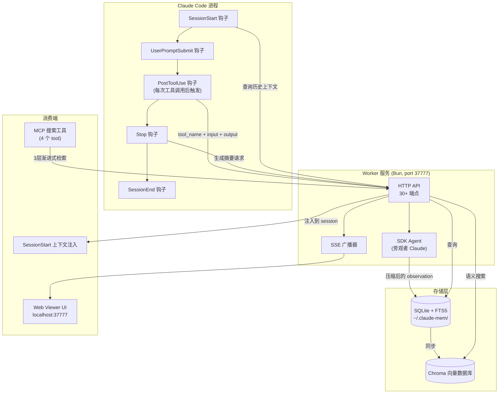
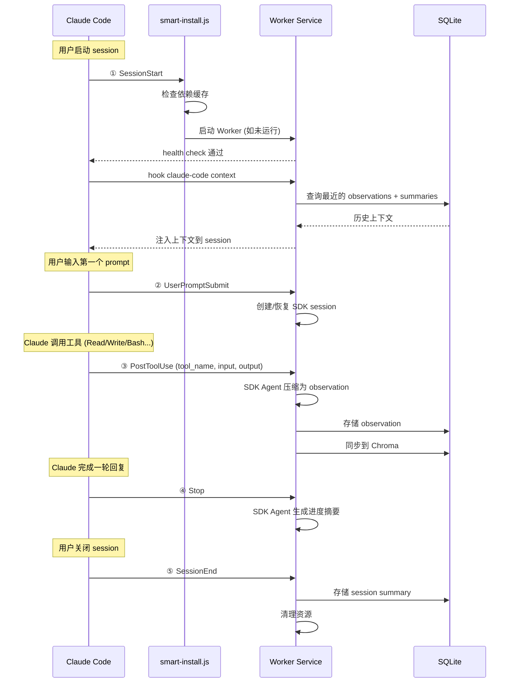
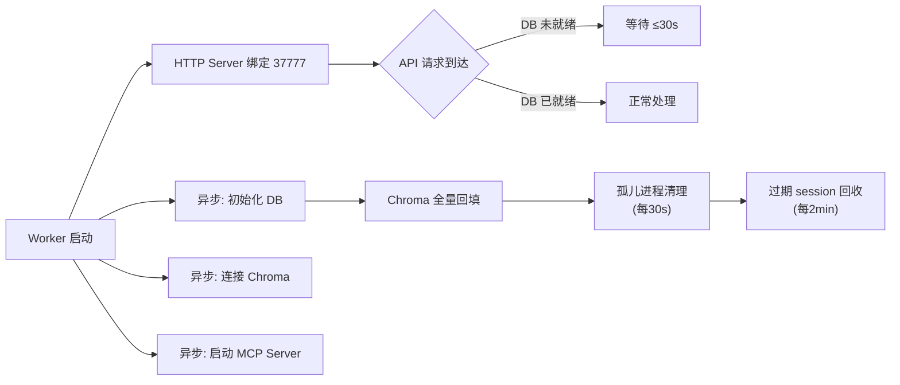
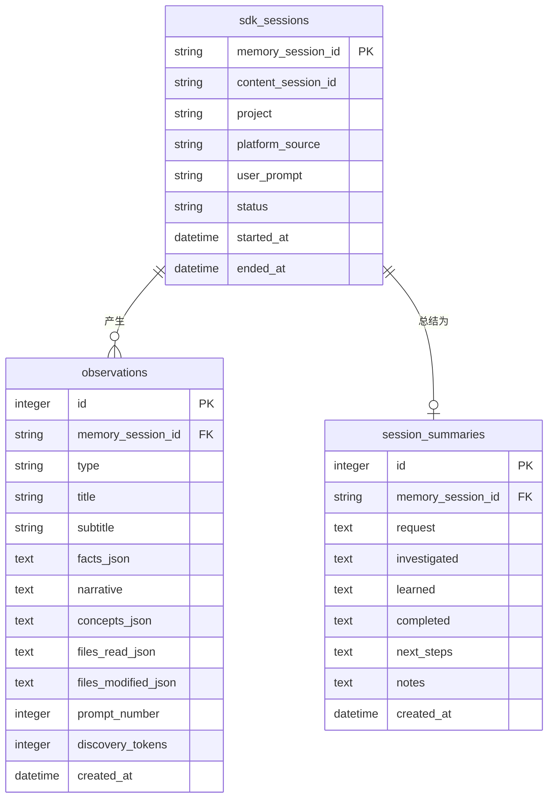
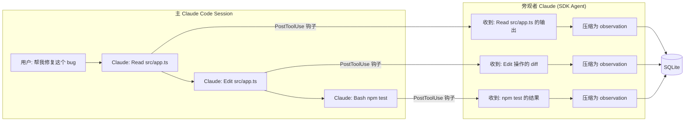
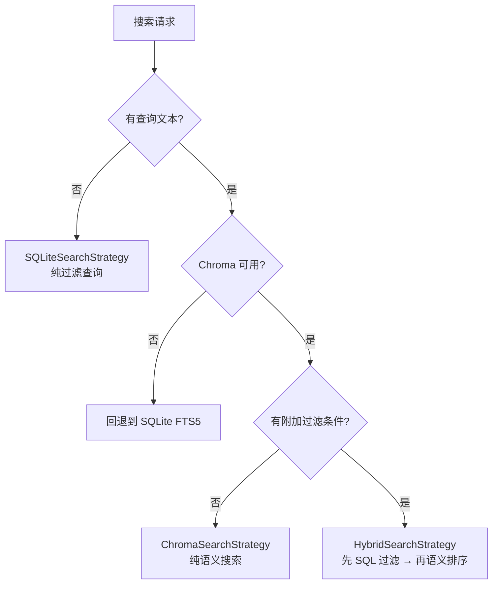

# claude-mem 深度解剖：给 Claude Code 装上长期记忆的 4.6 万星插件，到底做了什么

## 一、问题：每次对话都是失忆的

用 Claude Code 写了三天代码，第四天一开终端，它不认识你了。

你前天花两小时跟它梳理的项目架构、昨天 debug 到凌晨定位的那个竞态条件、你反复强调的"我们用 Supabase 不用 Firebase"——全部归零。Claude Code 的每个 session 都是一张白纸。你能做的是往 `CLAUDE.md` 里手写笔记，或者寄希望于 Claude 自己往 `MEMORY.md` 里塞点东西，但后者上限 200 行，而且写入质量看运气。

这个问题有多普遍？**claude-mem 在 GitHub 上 48 小时内冲到了 4.6 万星**，223 次发版，92 个贡献者，3500 个 fork。这些数字本身就是答案——开发者在为 AI 编码助手的"失忆症"投票。

claude-mem 的创造者 Alex Newman（[@thedotmack](https://github.com/thedotmack)）给出的方案是：**不要让人来记，让另一个 Claude 来记**。具体来说，他在 Claude Code 的生命周期钩子里嵌入一套观察系统，用 Claude Agent SDK 启动一个"旁观者"Claude 实例，实时压缩每次工具调用的结果，存进本地 SQLite + Chroma 向量数据库，下次启动时自动注入相关上下文。

这篇文章要做的事情是：**从源码级别拆开 claude-mem 的六大核心组件，画清楚数据怎么流、Token 怎么省、记忆怎么存和取**，最后汇总社区的真实评价——包括那份被标记为 HIGH 风险的安全审计。

---

## 二、整体架构：一个"旁观者"系统

在进入细节之前，先看全貌。claude-mem 不是一个简单的"把对话存到文件"的脚本，它是一个完整的分布式系统，包含六个核心组件：



关键洞察是这个"旁观者"（Observer）模式：**claude-mem 并不修改 Claude Code 本身的行为，它在旁边跑了另一个 Claude 实例，专门负责"看"主实例在做什么，然后把观察结果压缩存储**。这个设计让主 Claude 的 context window 不会被记忆管理任务污染，同时实现了 ~95% 的 token 压缩率。

---

## 三、生命周期钩子：五个关键时刻的拦截

claude-mem 的数据采集层建立在 Claude Code 的 hooks 机制上。hooks 是 Claude Code 提供的扩展点——在特定生命周期事件发生时执行外部脚本。claude-mem 注册了 **5 个生命周期钩子 + 1 个预检脚本**：



来看源码中 `hooks.json` 的实际配置（简化后）：

```json
{
  "hooks": [
    {
      "event": "SessionStart",
      "matcher": "startup|clear|compact",
      "steps": [
        { "command": "node smart-install.js" },
        { "command": "bun-runner.js worker-service.cjs start && health-poll" },
        { "command": "worker-cli.js hook claude-code context" }
      ]
    },
    {
      "event": "UserPromptSubmit",
      "command": "worker-cli.js hook claude-code session-init"
    },
    {
      "event": "PostToolUse",
      "matcher": "*",
      "command": "worker-cli.js hook claude-code observation"
    },
    {
      "event": "PreToolUse",
      "matcher": "Read",
      "command": "worker-cli.js hook claude-code file-context"
    },
    {
      "event": "Stop",
      "command": "worker-cli.js hook claude-code summarize"
    },
    {
      "event": "SessionEnd",
      "command": "worker-cli.js hook claude-code session-complete"
    }
  ]
}
```

几个值得注意的实现细节：

- **SessionStart 是三步串行的**：先跑 `smart-install.js` 做依赖检查（带缓存，不是每次都跑 npm install），再启动 Worker 服务并轮询 `localhost:37777/health` 最多 8 次，最后注入上下文。这确保了 Worker 一定在线才开始工作。
- **PostToolUse 的 matcher 是 `*`**：意味着**每一次**工具调用——Read 文件、Write 文件、Bash 命令、Grep 搜索——都会触发一次 observation 记录。这是最高频的钩子。
- **PreToolUse 的 Read 拦截**：在 Claude 读文件之前注入文件级上下文，让 Claude 在阅读代码时就能看到"上次你读这个文件时发现了什么"。
- 所有钩子命令都会动态解析 `CLAUDE_PLUGIN_ROOT` 路径，兼容缓存目录和 marketplace 安装路径，并把 NVM/Homebrew 路径注入 `$PATH`。

---

## 四、Worker 服务：一个常驻的 Bun 进程

Worker 是 claude-mem 的大脑。它是一个跑在端口 37777 上的 HTTP 服务，由 Bun 运行时管理，暴露了 30+ 个 API 端点。

### 4.1 两阶段启动

这是一个值得学习的工程设计。Worker 的启动分两步：

1. **HTTP 服务器立即启动**（让健康检查立刻通过）
2. **后台异步初始化**数据库、Chroma、MCP、搜索引擎等重服务

中间用一个 middleware 拦截 `/api/*` 请求：如果 DB 还没初始化完，等最多 30 秒。这样做的好处是——钩子的 health check 不会因为数据库初始化慢而超时失败。



### 4.2 核心服务编排

Worker 内部组合了这些服务：

| 服务 | 职责 |
|------|------|
| `DatabaseManager` | SQLite 连接池与迁移管理 |
| `SessionManager` | SDK session 的创建、恢复、消息队列 |
| `SDKAgent` / `GeminiAgent` / `OpenRouterAgent` | 多 AI 提供商的旁观者代理 |
| `SearchManager` | 封装三层搜索策略的统一入口 |
| `SSEBroadcaster` | Server-Sent Events，推送实时 observation 到 Web Viewer |
| `CorpusStore` / `KnowledgeAgent` | 知识语料库的构建与查询（高级特性） |
| `ChromaSync` | SQLite → Chroma 的增量同步 |

**多提供商路由**是一个实用设计：`getActiveAgent()` 根据 `settings.json` 选择使用 Claude（通过 Agent SDK）、Gemini 还是 OpenRouter 来跑旁观者代理。对于不想额外花 Claude API 费用的用户，可以切换到免费的 Gemini 模型。

### 4.3 进程管理

Worker 写 PID 文件到 `~/.claude-mem/`，每 30 秒跑一次**孤儿进程回收**（Issue #737 的修复——Chroma 子进程可能变僵尸），每 2 分钟回收**过期的 SDK session**（Issue #1168）。启动时还会自动恢复上次崩溃留下的 pending 消息队列。

---

## 五、数据层：SQLite + FTS5 全文搜索

### 5.1 数据库设计

claude-mem 的持久化层是 SQLite，存储在 `~/.claude-mem/claude-mem.db`。选择 SQLite 而非 PostgreSQL 或其他远程数据库，是因为**claude-mem 是一个纯本地工具——你的代码、你的 prompt、你的决策，全部留在自己的机器上**。

数据库有三张核心表：



**Observation** 是最核心的数据单元，每次工具调用经过 SDK Agent 压缩后产生一条。它的 `type` 字段是枚举值：`decision`（架构决策）、`bugfix`（修复记录）、`feature`（新增功能）、`discovery`（发现/洞察）等。一条典型的 observation 长这样：

```xml
<observation>
  <type>bugfix</type>
  <title>修复 WebSocket 重连时的消息丢失</title>
  <subtitle>心跳超时后重建连接，replay 缓冲区中的未确认消息</subtitle>
  <facts>
    - reconnect() 方法缺少对 pending_acks 队列的重放
    - 心跳间隔从 30s 改为 15s 以更早检测断连
    - 新增 message_buffer 环形缓冲区，保留最近 100 条消息
  </facts>
  <narrative>用户在 debug 一个生产环境的 WebSocket 消息丢失问题。根因是 reconnect 函数重建了连接但没有重放 pending_acks 中的消息...</narrative>
  <concepts>WebSocket, reconnection, message buffering, heartbeat</concepts>
  <files_modified>src/ws/client.ts, src/ws/buffer.ts</files_modified>
</observation>
```

原始工具输出可能是 1,000-10,000 个 token（想想 `cat` 一个 500 行文件的输出），压缩后的 observation 大约 500 个 token。**这是 claude-mem 宣称的"~95% token 压缩率"的来源**。

### 5.2 数据库优化

源码中 `Database.ts` 开启了这些 SQLite PRAGMA：

```typescript
// WAL 模式，支持并发读写
db.exec("PRAGMA journal_mode = WAL");
// 普通同步（非 FULL），提升写入性能
db.exec("PRAGMA synchronous = NORMAL");
// 256MB mmap，让大查询走内存映射
db.exec("PRAGMA mmap_size = 268435456");
// 10000 页缓存（约 40MB）
db.exec("PRAGMA cache_size = 10000");
// 临时表存内存
db.exec("PRAGMA temp_store = MEMORY");
```

FTS5 全文搜索建在 observation 的 `title`、`narrative`、`facts` 字段上，支持分词检索。

还有一个有趣的工程细节：`repairMalformedSchema()` 函数处理一种特殊情况——当用户在不同机器之间同步 `.claude-mem/` 目录时，SQLite 的 schema 可能损坏。它的解法是 shell out 到 Python 的 `sqlite3` 模块（Python 版本支持 `writable_schema`），删除孤立的索引对象。这是 `bun:sqlite` 无法直接做到的事。

---

## 六、SDK Agent：让另一个 Claude "看" 你的 session

这是 claude-mem 最核心也最有创意的组件。

### 6.1 旁观者模式

`SDKAgent`（位于 `src/services/worker/SDKAgent.ts`）使用 `@anthropic-ai/claude-agent-sdk` 的 `query()` 函数启动一个独立的 Claude 对话。关键约束是：**这个旁观者 Claude 没有任何工具权限**——Bash、Read、Write、Edit 全部禁用。它只能"看"和"总结"，不能"做"。



### 6.2 Prompt 工程

旁观者 Claude 的 prompt 设计（位于 `src/sdk/prompts.ts`）分四个构造器：

- **`buildInitPrompt`**：建立旁观者身份——"你是一个开发 session 的观察者，你的任务是把工具调用的原始输出压缩为结构化的 observation"，并定义输出格式（XML `<observation>` 块，包含 type/title/subtitle/facts/narrative/concepts/files 字段）。
- **`buildObservationPrompt`**：把每次工具调用包装在 `<observed_from_primary_session>` XML 标签中传给旁观者。
- **`buildSummaryPrompt`**：session 结束时切换到摘要模式，输出 `<summary>` 格式（request/investigated/learned/completed/next_steps/notes）。
- **`buildContinuationPrompt`**：第 2 个 prompt 起，重新建立旁观者上下文（因为 Agent SDK 的每轮对话可能丢失一些系统上下文）。

### 6.3 session 管理

旁观者 Claude 维护自己的 session（通过 `memory_session_id` 跟踪），使用**异步生成器**（`createMessageGenerator`）从 `SessionManager` 的消息队列中逐条消费。恢复逻辑是保守的：只有同时满足 `memorySessionId` 存在、`lastPromptNumber > 1`、`forceInit` 未设置三个条件才恢复，否则创建新 session。这防止了 Worker 崩溃重启后"续接"一个已经不一致的 session。

并发控制通过 `CLAUDE_MEM_MAX_CONCURRENT_AGENTS`（默认 2）限制同时运行的旁观者代理数量。Agent 使用隔离的环境变量文件（`~/.claude-mem/.env`），避免项目 `.env` 中的 API key 污染。

---

## 七、三层渐进式搜索：Token 效率的关键

"记住"只是第一步。更难的问题是：**当你积累了几千条 observation 之后，怎么在不炸掉 context window 的情况下找到相关的那几条？**

claude-mem 的回答是"Progressive Disclosure"——不一次性把所有记忆倾倒出来，而是分三层逐步缩小范围：

```mermaid
graph TD
    A["用户查询: 'authentication bug'"] --> B["Layer 1: search<br/>返回索引 (~50-100 token/条)"]
    B --> C{"相关结果?"}
    C -- "是" --> D["Layer 2: timeline<br/>返回时间线上下文"]
    C -- "否" --> E["结束: 没有相关记忆"]
    D --> F{"需要完整细节?"}
    F -- "是" --> G["Layer 3: get_observations<br/>返回完整内容 (~500-1000 token/条)"]
    F -- "否" --> H["已获得足够上下文"]

    style B fill:#1e3a5f
    style D fill:#1e3a5f
    style G fill:#1e3a5f
```



### 7.1 三层工作流

| 层级 | MCP 工具 | 返回内容 | Token 开销 |
|------|---------|---------|-----------|
| Layer 1 | `search` | observation ID + 标题 + 类型 + 时间戳 | ~50-100/条 |
| Layer 2 | `timeline` | 特定 observation 前后的时间线叙事 | 按需 |
| Layer 3 | `get_observations` | 完整的 observation 内容 | ~500-1,000/条 |

实际使用时，Claude 会先用 `search` 拿到一个索引列表（比如 20 条结果，总共 ~1,000 token），然后从中筛选出 2-3 条相关的，再用 `get_observations` 批量获取完整内容（~2,000 token）。相比直接倾倒全部记忆（可能几万 token），这是 **~10 倍的 token 节省**。

### 7.2 混合搜索策略

搜索系统的核心是 `SearchOrchestrator`（`src/services/worker/search/SearchOrchestrator.ts`），它根据查询条件智能选择三种策略：



**HybridSearchStrategy** 的 4 步流程特别值得细看：

1. **SQLite 元数据过滤**：先用 SQL 条件（类型、日期、项目、文件名）从数据库中筛出候选 ID 集合
2. **Chroma 语义排序**：把候选 ID 发给 Chroma，用向量相似度对它们排序
3. **集合交集**：取两者的交集，保留 Chroma 的排序顺序
4. **SQLite 水合**：按语义排序顺序从 SQLite 批量读取完整记录

这个设计的巧妙之处在于：**SQL 擅长精确过滤（"只看 bugfix 类型、最近一周"），向量搜索擅长语义匹配（"跟 authentication 相关的"），两者互补**。

### 7.3 Chroma 向量数据库同步

`ChromaSync`（`src/services/sync/ChromaSync.ts`）负责把 SQLite 数据同步到 Chroma。同步方式是**细粒度文档拆分**：

- 一条 observation 被拆成多个 Chroma 文档——narrative 一个、text 一个、每条 fact 各一个
- 一条 summary 被拆成 request、investigated、learned 等字段各一个文档
- 用户 prompt 是单独一个文档

文档 ID 格式为 `obs_123_narrative`、`summary_45_learned`、`prompt_67`。查询时通过解析 ID 前缀反向定位 SQLite 记录。这种拆分让语义搜索能精确到 observation 的**某个字段**级别，而不是整条记录。

`ChromaMcpManager` 通过 MCP stdio 协议管理 `chroma-mcp`（Python）子进程。它支持本地 persistent 模式和远程 HTTP 模式，使用惰性连接（第一次 `callTool()` 时才连），有连接锁防止并发连接、10 秒重连退避、子进程死亡自动重连等健壮性设计。甚至针对企业环境做了适配：检测 macOS 钥匙串中的 Zscaler 证书，创建合并 SSL 证书包以穿越企业代理。

---

## 八、上下文注入：从"记住"到"想起来"

存储和搜索解决了"记忆在哪"的问题。**上下文注入解决"怎么把记忆用起来"的问题**——即在新 session 启动时，自动把相关历史注入 Claude 的 context。

`ContextBuilder`（`src/services/context/ContextBuilder.ts`）是注入的编排器，流程如下：

1. 通过 `ContextConfigLoader` 加载配置（用户可以细粒度控制注入什么）
2. 从 SQLite 查询当前项目的近期 observations 和 summaries（支持 git worktree 多项目场景）
3. 用 `TokenCalculator` 估算 token 预算
4. 按时间线渲染：`HeaderRenderer`（系统信息） → `TimelineRenderer`（observations 和 summaries 按时间交错排列） → `SummaryRenderer`（最近一次的完整摘要） → `FooterRenderer`（说明和引用）

注入格式是一段 XML 标记的 Markdown，包裹在 `<claude-mem-context>` 标签中，写入到项目的 `CLAUDE.md` 文件里。低层级的 `context-injection.ts` 负责精确替换标签之间的内容（如果标签不存在则追加）。

这意味着 **claude-mem 和 Claude Code 原生的 `CLAUDE.md` 机制是共生关系**——它利用 Claude Code 已有的"启动时读取 CLAUDE.md"行为，把自己的上下文搭便车注入进去。

---

## 九、MCP 服务器：让 Claude Desktop 也能搜索记忆

`mcp-server.ts` 把 claude-mem 暴露为标准 MCP Tool Server，注册了 **13 个工具**：

| 工具 | 用途 |
|------|------|
| `search` | 搜索记忆索引 |
| `timeline` | 获取时间线上下文 |
| `get_observations` | 批量获取完整 observation |
| `smart_search` / `smart_unfold` / `smart_outline` | 基于 tree-sitter AST 的代码导航 |
| `build_corpus` / `list_corpora` / `prime_corpus` / `query_corpus` / `rebuild_corpus` / `reprime_corpus` | 知识语料库管理 |
| `__IMPORTANT` | 工作流说明（告诉 Claude 使用 3 层搜索模式） |

所有记忆相关工具通过 `workerHttpRequest()` 委托到 Worker 的 HTTP API。`smart_*` 系列工具使用本地 tree-sitter 解析（dev dependencies 中那一长串 `tree-sitter-*` 包就是为此），不需要 Worker。

MCP 服务器还包含孤儿检测（每 30 秒检查 `ppid`）和 stdio 生命周期监控，确保 Claude Desktop 关闭时清理退出。控制台输出重定向到 stderr 以保护 JSON-RPC 的 stdio 通道。

---

## 十、安全审计：HIGH 风险评级

2026 年 2 月，社区对 claude-mem v10.5.2 进行了一次全面安全审计（[GitHub Issue #1251](https://github.com/thedotmack/claude-mem/issues/1251)），评级为 **HIGH 风险**。核心发现包括 4 个 Critical、6 个 Medium、7 个 Low/Info 级别问题：

### 10.1 四个 Critical 级问题

| 编号 | 问题 | 风险 |
|------|------|------|
| C-1 | `smart_unfold`/`smart_outline` 的 `file_path` 参数无路径校验 | **任意文件读取**（SSH 密钥、.env 文件） |
| C-2 | 30+ HTTP 端点零认证 | 任何本地进程可读取所有 API 密钥、用户 prompt、代码观察记录 |
| C-3 | Worker 绑定 `0.0.0.0` | 局域网内所有设备都能访问 |
| C-4 | `GET /api/settings` 返回明文 API 密钥 | Gemini/OpenRouter/Anthropic 密钥全部暴露 |

**最严重的是 C-2**。`GET /api/settings` 可以直接拿到你配置的所有 AI 提供商密钥。`POST /api/sessions/*/observations` 可以**注入虚假记忆**。`DELETE` 端点可以清除所有数据。这些操作不需要任何认证。

审计建议的 P0 修复：对 HTTP API 添加 token 认证（启动时生成随机 Bearer Token），或改用 Unix Socket 替代 TCP。

### 10.2 工程启示

这次审计揭示了一个在"本地优先"工具中常见的盲点：**"本地运行"不等于"安全"**。当你的工具在一个众所周知的端口（37777）上跑一个无认证的 HTTP API 时，任何恶意的 npm 包、浏览器扩展、或者同一 Wi-Fi 上的设备都可能利用这个攻击面。

---

## 十一、生态位与替代方案

claude-mem 不是唯一的选择。把它放在更大的生态中看：

| 方案 | 核心思路 | 优势 | 劣势 |
|------|---------|------|------|
| **claude-mem** | Hook + 旁观者 Agent 压缩 + 向量搜索 | 自动化程度最高，语义搜索强，社区最大 | 重依赖（Bun + Chroma + SQLite），安全问题待修 |
| **claude-memory-compiler** | Karpathy 式知识库 + LLM 编译器 | 结构化文章交叉引用，LLM 搜索优于向量 | 每日编译成本 ~$0.5，KB 增长后成本上升 |
| **Claude 原生 MEMORY.md** | Claude Code 内置，自动写 200 行 | 零配置，零成本 | 容量极小，写入质量不可控 |
| **CLAUDE.md 手写笔记** | 开发者手动维护 | 完全可控，无隐私风险 | 纯人力，无法自动回忆 |
| **DIY Hook 脚本** | PowerShell/Bash 手写钩子 | 零依赖，完全透明 | 无压缩，无语义搜索 |

claude-mem 的独特定位是**"全自动 + 语义搜索 + 多 IDE 支持"三者的交集**。它能跨 Claude Code、Cursor、Gemini CLI、Windsurf、OpenClaw 工作，这让它在多 IDE 切换的开发者中特别受欢迎。

---

## 十二、社区评价：从 46K 星到"voodoo nonsense"

### 正面评价

**DataCamp 教程**将其称为"persistent memory through structured compression and retrieval"的代表作。**Augment Code 的分析**指出："context management is quietly becoming the most important layer in AI-assisted development, and claude-mem is one of the better tools addressing it"。多个独立测评确认了 ~10x token 节省的宣称，并赞扬了渐进式检索设计的实用性。

**Emelia.io 的评测**提出一个有价值的使用建议："对于快速的单 session 任务，claude-mem 可能是大材小用——原生 context 足够了。但一旦项目进入第二天，持久化记忆就变成刚需。"

### 批判意见

安全审计的 HIGH 风险评级是最大的硬伤。端口 37777 上运行无认证 HTTP API、路径穿越可读任意文件——这些不是"理论漏洞"，而是实际可利用的攻击面。

**DEV Community 的对比文章**指出一个更根本的问题：claude-mem 的旁观者 Agent 本身需要消耗 Claude API token。虽然可以切换到免费的 Gemini，但这意味着你的代码记忆的压缩质量取决于一个不同的、可能更弱的模型。

此外，`$CMEM` Solana 代币的存在引发了一些社区成员对项目动机的质疑——虽然项目方强调代币是"第三方创建但官方拥抱"的社区催化剂，但一个开源工具与 meme coin 的关联多少让人不安。

### AGPL-3.0 许可证

claude-mem 采用 AGPL-3.0 许可证，这意味着：如果你修改 claude-mem 并通过网络提供服务，必须公开源码。对于企业内部使用没有问题，但如果你想把它嵌入商业产品，这个许可证是一个硬限制。项目中的 `ragtime/` 目录更加严格，使用 PolyForm Noncommercial License 1.0.0——禁止任何商业用途。

---

## 十三、总结：一个精妙但有风险的工程

从纯工程角度看，claude-mem 是一件令人印象深刻的作品。它的核心洞察——**用一个只读的旁观者 Agent 做压缩，通过渐进式检索控制 token 预算，借助混合搜索平衡精确过滤和语义匹配**——是当前 AI 编码助手生态中对"跨 session 记忆"问题最完整的回答之一。

但它也是一个尚未成熟的作品。无认证的 HTTP API、路径穿越漏洞、与加密代币的关联——这些问题提醒我们，46K 星不等于可以无条件信任。**在安装 claude-mem 之前，你需要评估你的 coding session 数据对你有多敏感，以及你是否愿意在本地端口上开一个无认证的接口。**

如果你决定使用它，建议至少做到：
1. **不要在公共 Wi-Fi 上使用**（0.0.0.0 绑定意味着局域网暴露）
2. **检查 `settings.json` 中不要存敏感的 API 密钥**（或等待认证功能上线）
3. **给敏感代码加 `<private>` 标签**（被标记的内容不会进入存储）

上下文管理正在成为 AI 辅助开发中最重要的基础设施层。claude-mem 用 4.6 万颗星证明了这个需求的真实性，用 223 次发版证明了迭代速度，也用一次安全审计提醒了我们——在给 AI 装上长期记忆的同时，别忘了问一句：**这些记忆，谁都能看到吗？**

---

## 参考链接

- [claude-mem GitHub 仓库](https://github.com/thedotmack/claude-mem)
- [claude-mem 官方文档](https://docs.claude-mem.ai/)
- [claude-mem npm 包](https://www.npmjs.com/package/claude-mem)
- [安全审计 Issue #1251](https://github.com/thedotmack/claude-mem/issues/1251)
- [Augment Code: claude-mem 46.1K Stars 分析](https://www.augmentcode.com/learn/claude-mem-46k-stars-persistent-memory-claude-code)
- [DataCamp: Claude-Mem 指南](https://www.datacamp.com/tutorial/claude-mem-guide)
- [TrigiDigital: Claude-Mem Plugin Review 2026](https://trigidigital.com/blog/claude-mem-plugin-review-2026/)
- [Medium: Claude-Mem 长期记忆深度分析](https://medium.com/coding-nexus/claude-mem-giving-claude-code-a-long-term-memory-7f90b46d6cf5)
- [DEV Community: claude-mem + DIY 替代方案对比](https://dev.to/kanta13jp1/adding-persistent-memory-to-claude-code-with-claude-mem-plus-a-diy-lightweight-alternative-4gha)
- [claude-memory-compiler (Karpathy 式知识库方案)](https://github.com/coleam00/claude-memory-compiler)
