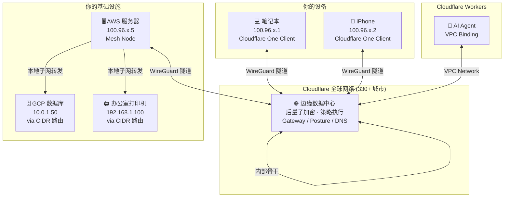
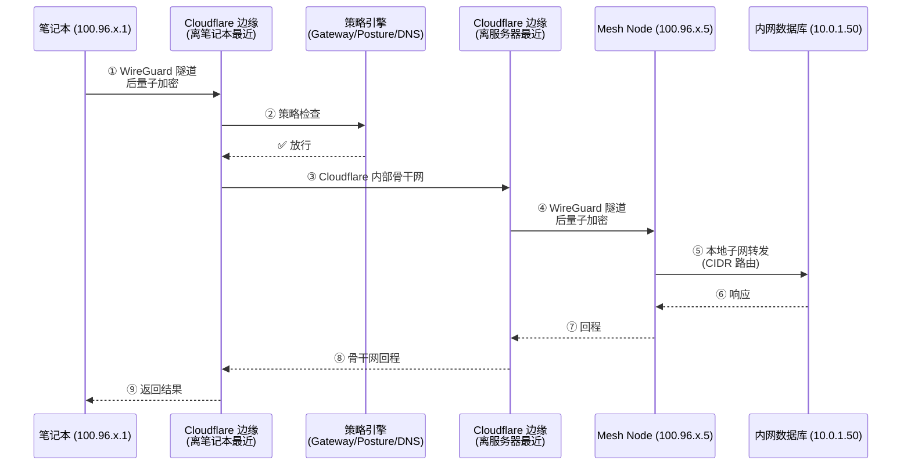

# Cloudflare Mesh 全解析：为 AI Agent 时代设计的私有组网

## 一、背景：AI Agent 需要"进内网"

2026 年 4 月 14 日，Cloudflare 在 Agents Week 期间发布了 **Cloudflare Mesh**——一个全新的私有组网产品。公告标题直接点题："Secure private networking for everyone: users, nodes, agents, Workers"。

这个产品解决的问题很具体：**你的 AI Agent 跑在云端（比如 Cloudflare Workers），但它需要访问你公司内网的数据库、Staging 环境的 API、甚至办公室 NAS 上的文件。怎么让 Agent 安全地"进内网"，同时不把内网暴露到公网？**

传统方案是 VPN 或堡垒机，但这些东西不是为 Agent 设计的——它们假设"连接者是人"，需要交互式认证，不适合自主运行的 AI 程序。Cloudflare Mesh 的回答是：**给所有设备、服务器、Agent 各分配一个私有 IP，通过 Cloudflare 的全球网络互相直连，不需要 VPN、不需要堡垒机、不需要公网暴露**。

Mesh 不是凭空出现的。它的前身是 WARP Connector——现在 WARP Connector 更名为"Mesh Node"，WARP Client 更名为"Cloudflare One Client"。已有部署无需迁移，API 兼容。但品牌重塑的背后是产品定位的根本变化：从"企业 VPN 替代品"升级为"AI Agent 时代的私有网络基础设施"。

---

## 二、核心架构：全双向、多对多、Cloudflare 中转

### 2.1 网络拓扑

Mesh 的网络模型是**全双向、多对多**的——任意参与者可以通过私有 IP 直接访问任意其他参与者。这与 Cloudflare Tunnel 截然不同（Tunnel 是单向的：从边缘入站到服务）。



**关键设计决策：所有流量经 Cloudflare 中转，不走点对点直连。** 这意味着：

- **不存在 NAT 穿透问题**——无论你的设备在哪种网络环境下（公司防火墙、酒店 Wi-Fi、4G），只要能连到 Cloudflare 边缘就行
- **安全策略在中转层执行**——Gateway 网络策略、设备姿态检查、Access 规则自动生效，不需要额外配置
- **代价是多一跳延迟**——流量不是 A→B 直连，而是 A→Cloudflare→B，但 Cloudflare 在全球 330+ 个城市有数据中心，实际延迟增加通常可控

### 2.2 IP 分配

每个加入 Mesh 的参与者自动获得一个 `100.96.0.0/12` 范围的私有 IP。这个范围属于 **CGNAT 地址空间**（Carrier-Grade NAT），故意避开了 RFC 1918 的三个常见私有网段（10.x、172.16.x、192.168.x），防止与你已有的内网 IP 冲突。

如果你的环境恰好用了 100.96 开头的地址（极少见），可以在 Dashboard 配置自定义子网。

### 2.3 三种参与者

| 类型 | 运行环境 | 客户端 | 能力 |
|------|---------|--------|------|
| **Mesh Node** | Linux 服务器/VM/容器 | `warp-cli` 无头模式 | 获得 Mesh IP + 可广播 CIDR 路由 + 支持主备高可用 |
| **Client Device** | 笔记本/手机/桌面 | Cloudflare One Client（带 UI） | 获得 Mesh IP + 访问 Mesh Node 和其路由的子网 |
| **Workers Agent** | Cloudflare Workers / Durable Objects | VPC Network Binding | 通过 `env.MESH.fetch()` 访问整个 Mesh 网络 |

注意一个有趣的特性：**Client 到 Client 的直连不需要部署任何 Mesh Node**。两台笔记本只要都装了 Cloudflare One Client 并加入同一个 Zero Trust 组织，就能互相 ping 通。

---

## 三、实际使用：从零搭建一个 Mesh 网络

### 3.1 创建 Mesh Node

Dashboard 路径：**Networking → Mesh → Add a node**

在 Linux 服务器上执行：

```bash
# Debian/Ubuntu
curl -fsSL https://pkg.cloudflareclient.com/pubkey.gpg | \
  sudo gpg --yes --dearmor -o /usr/share/keyrings/cloudflare-warp-archive-keyring.gpg

echo "deb [signed-by=/usr/share/keyrings/cloudflare-warp-archive-keyring.gpg] \
  https://pkg.cloudflareclient.com/ $(lsb_release -cs) main" | \
  sudo tee /etc/apt/sources.list.d/cloudflare-client.list

sudo apt-get update && sudo apt-get install -y cloudflare-warp

# 用 Dashboard 生成的 Token 注册
sudo warp-cli connector new <TOKEN>
sudo warp-cli connect
```

支持的系统：CentOS 8、RHEL 8、Debian 12-13、Ubuntu 22.04/24.04 LTS、Fedora 34-35。架构支持 x86-64 和 ARM64。资源占用很小：75MB 磁盘 + 35MB 内存。

### 3.2 连接客户端设备

**桌面端**（Windows/macOS/Linux，需 v2026.2+）：

1. 下载安装 Cloudflare One Client
2. 启动 → 选择 "Zero Trust security"
3. 输入你的 team name（Zero Trust 组织名）
4. 完成身份认证
5. 自动获得 Mesh IP，连接建立

**移动端**（iOS/Android）：

1. 安装 Cloudflare One Agent
2. 输入 team name → 认证 → 安装 VPN Profile → 开启连接

### 3.3 测试连通性

```bash
# 在笔记本上 ping 服务器的 Mesh IP
ping 100.96.x.5

# SSH 直连，无需堡垒机
ssh user@100.96.x.5
```

TCP、UDP、ICMP 全部支持。

### 3.4 配置 CIDR 路由：让子网设备可达

Mesh Node 默认只暴露自己的 Mesh IP。如果你想让 Node 所在子网的数据库（10.0.1.50）、打印机（192.168.1.100）等设备也能被 Mesh 网络访问，需要配置 CIDR 路由：

Dashboard：**Mesh Node → Routes → Add route → `10.0.0.0/24`**

配置后，Mesh Node 充当**网关**：发往 10.0.0.0/24 的流量先到 Node，Node 再转发到本地子网的目标主机。

对于不是默认网关的 Node，还需要在路由器上加一条静态路由：

```
目标: 100.96.0.0/12（Mesh IP 范围）
下一跳: Node 的本地子网 IP
```

这样返回流量才能正确路由回 Mesh 网络。

**高可用**：生产环境建议为广播 CIDR 路由的 Node 配置主备副本。当主节点宕机时，Cloudflare 自动提升备用节点，子网流量无中断。

### 3.5 Workers Agent 通过 VPC Binding 访问 Mesh

这是 Mesh 最有差异化的场景：让 Cloudflare Workers 上的 AI Agent 访问你的整个私有网络。

**wrangler.jsonc 配置**：

```json
{
  "name": "my-agent",
  "main": "src/index.js",
  "compatibility_date": "2026-04-15",
  "vpc_services": [
    {
      "binding": "INTERNAL_API",
      "service_id": "<YOUR_SERVICE_ID>",
      "remote": true
    }
  ]
}
```

**Worker 代码**：

```javascript
export default {
  async fetch(request, env, ctx) {
    // 直接通过私有 IP 访问内网 API，无需公网暴露
    const response = await env.INTERNAL_API.fetch(
      "http://10.0.1.50:8080/api/data"
    );
    return response;
  }
};
```

**一行 `env.INTERNAL_API.fetch()` 就让 Workers 上的 Agent 穿透进了你的私有网络。** Cloudflare 的网络层自动处理路由，无论 Worker 在全球哪个边缘节点执行。

---

## 四、流量原理：从发包到收包

一个完整的请求路径如下：



步骤拆解：

1. **WireGuard 隧道建立**：笔记本的 Cloudflare One Client 与最近的 Cloudflare 边缘建立后量子加密的 WireGuard 隧道。"后量子"指的是密钥交换使用了抗量子计算攻击的算法
2. **策略执行**：Cloudflare 在中转层执行 Gateway 网络策略（允许/阻止特定 IP/端口）、设备姿态检查（操作系统版本、磁盘加密状态）、DNS 过滤
3. **骨干网传输**：通过 Cloudflare 自己的全球骨干网到达离目标最近的数据中心——同一套基础设施服务着全球最大的网站们
4. **到达 Mesh Node**：通过另一条 WireGuard 隧道到达目标 Mesh Node
5. **子网转发**：如果目标 IP 在 Node 广播的 CIDR 路由范围内，Node 将流量转发到本地子网的目标设备

---

## 五、典型场景

### 场景一：AI Agent 访问 Staging 数据库

你的 AI Agent 跑在 Cloudflare Workers 上（用 Agents SDK 构建），需要查询公司的 Staging PostgreSQL 数据库。

**以前**：要么把数据库端口暴露到公网（危险），要么搞一层 API Gateway + VPN（复杂），要么在 Cloudflare Tunnel 里为每个服务单独配置（繁琐）。

**现在**：Staging 服务器装 Mesh Node 并广播 CIDR 路由 → Worker 配置 VPC Binding → Agent 直接 `env.MESH.fetch("http://10.0.1.50:5432")` 查询数据库。整个过程加密传输、策略管控，数据库对公网完全不可见。

### 场景二：多云互联

AWS 的应用服务器、GCP 的数据库、Azure 的消息队列——每个云装一个 Mesh Node，三分钟形成统一私有网络。不需要配置 VPC Peering、Transit Gateway、跨云 VPN。

### 场景三：远程开发

笔记本装 Cloudflare One Client，开发服务器装 Mesh Node。无论你在家、咖啡厅还是飞机上，`ssh 100.96.x.5` 直连，不需要堡垒机、不需要端口转发、不需要记住每次变化的公网 IP。

### 场景四：IoT / 不可安装 Agent 的设备

打印机、摄像头、传感器——这些设备无法安装客户端。通过 Mesh Node 广播 CIDR 路由，Node 充当网关，整个 Mesh 网络都能访问它们。

---

## 六、与 Tailscale / WireGuard 的对比

Cloudflare Mesh 最常被拿来与 Tailscale 比较，因为两者都在做"现代化的私有组网"。但架构路线截然不同：

| | **Cloudflare Mesh** | **Tailscale** | **原生 WireGuard** |
|--|---------------------|---------------|-------------------|
| **路由模型** | 全部走 Cloudflare 中转 | P2P 直连（DERP 中继兜底） | 纯 P2P |
| **延迟** | 稍高（多一跳） | 最低（直连时 1-3ms） | 最低 |
| **安全策略** | 内置 Gateway/Posture/DNS | ACL 需额外配置 | 需完全自建 |
| **AI Agent 集成** | Workers VPC Binding 原生支持 | 无 | 无 |
| **加密** | 后量子 WireGuard | 标准 WireGuard | 标准 WireGuard |
| **流量可见性** | Cloudflare 可审计全部流量 | 端到端加密，中间不可见 | 端到端加密 |
| **管理面** | Cloudflare Dashboard / API | Tailscale Admin Console | 手动配置 |
| **免费额度** | 50 节点 + 50 用户 | 100 设备 | 无限（自建） |

**Tailscale 的哲学是"去中心化"**——流量尽量 P2P 直连，只有打洞失败才走中继。好处是延迟最低、隐私最强（连 Tailscale 自己都看不到你的流量内容）。

**Cloudflare Mesh 的哲学是"中心化管控"**——所有流量过 Cloudflare，好处是可以在中间做策略执行、审计、DDoS 防护，并且与 Workers 生态无缝集成。代价是多一跳延迟和 Cloudflare 理论上能看到流量元数据。

**选择建议**：

- **需要 AI Agent 访问私有网络** → Cloudflare Mesh（Workers VPC Binding 是独有能力）
- **需要最低延迟的设备互联** → Tailscale（P2P 直连 1-3ms）
- **需要企业级策略管控和审计** → Cloudflare Mesh（Gateway + Posture 开箱即用）
- **极客自建、完全自主** → 原生 WireGuard（没有任何第三方参与）
- **家庭服务器远程访问** → Tailscale（最简单、延迟最低）

---

## 七、未来路线图

Cloudflare 在博客中透露了 2026 年夏季计划的几项能力：

- **Hostname Routing**：用 `wiki.local` 而非 IP 地址访问 Mesh 内的服务
- **Mesh DNS**：节点自动获得可路由的内部主机名，如 `postgres-staging.mesh`
- **Identity-Aware Routing**：Agent 携带三层身份——授权人（哪个人类授权了这个 Agent）、Agent 身份（具体是哪个 AI 系统）、权限范围（被允许做什么）。策略可以基于这三层身份做细粒度控制
- **Mesh in Containers**：提供 Docker 镜像，让 Mesh Node 可以跑在 K8s Pod、Docker Compose 和 CI/CD Runner 中，容器销毁时自动清理

其中 **Identity-Aware Routing** 最值得关注——它在网络层解决了"这个 Agent 是谁授权的、它是什么、它能做什么"这三个问题。这正是当前 AI Agent 安全领域最缺的一块拼图。

---

## 八、总结

Cloudflare Mesh 的核心贡献不在于"又一个 VPN 替代品"，而在于它第一次在网络基础设施层面正面回答了一个问题：**当 AI Agent 需要像人一样访问企业内网时，网络架构应该长什么样？**

答案是：给 Agent 一个身份、一个私有 IP、一套策略管控——跟给人类员工发工卡、分配工位、设定权限是同一套逻辑，只不过搬到了网络层。

免费额度（50 节点 + 50 用户）足够大多数开发团队使用。如果你的 AI Agent 项目需要访问私有基础设施，Cloudflare Mesh + Workers VPC Binding 目前是最省事的方案——前提是你接受"所有流量过 Cloudflare"这个架构取舍。

---

## 参考链接

- [Cloudflare Blog: Introducing Mesh](https://blog.cloudflare.com/mesh/)
- [Cloudflare Mesh 官方文档](https://developers.cloudflare.com/cloudflare-one/networks/connectors/cloudflare-mesh/)
- [Get Started 快速上手](https://developers.cloudflare.com/cloudflare-one/networks/connectors/cloudflare-mesh/get-started/)
- [CIDR Routes 路由配置](https://developers.cloudflare.com/cloudflare-one/networks/connectors/cloudflare-mesh/routes/)
- [Workers VPC: 访问私有 API 示例](https://developers.cloudflare.com/workers-vpc/examples/private-api/)
- [Cloudflare 新闻稿](https://www.cloudflare.com/press/press-releases/2026/cloudflare-launches-mesh-to-secure-the-ai-agent-lifecycle/)
- [Changelog 公告](https://developers.cloudflare.com/changelog/post/2026-04-14-cloudflare-mesh/)
